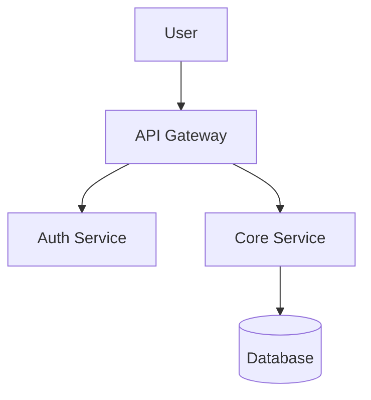

# Documentation Synthesis Skill

This skill automatically generates comprehensive documentation from existing code, specifications, and project artifacts.

## When to Use This Skill

- Generating API documentation from code
- Creating architecture documentation from codebase analysis
- Writing user guides and tutorials
- Synthesizing README files
- Documenting existing undocumented code
- Creating onboarding documentation

## Documentation Types

### 1. API Documentation
- Endpoint reference
- Request/response schemas
- Authentication details
- Error codes and handling
- Usage examples

### 2. Architecture Documentation
- System overview
- Component diagrams
- Data flow
- Integration points
- Deployment architecture

### 3. User Guides
- Getting started tutorials
- Feature walkthroughs
- Configuration guides
- Troubleshooting

### 4. Developer Documentation
- Setup instructions
- Contributing guidelines
- Code conventions
- Testing strategies

## Workflow

### Step 1: Source Analysis

1. **Scan Project Structure**
   - Identify source code directories
   - Locate existing documentation
   - Find configuration files
   - Discover test files

2. **Extract Documentation Sources**
   - Code comments and docstrings
   - Existing specs (PRD, FRD, ADR)
   - README files
   - Configuration files
   - API definitions (OpenAPI, GraphQL schemas)

### Step 2: Content Extraction

1. **Code Analysis**
   ```
   For each source file:
   - Extract class/function signatures
   - Parse docstrings and comments
   - Identify public APIs
   - Map dependencies
   ```

2. **Spec Analysis**
   ```
   From PRD/FRD:
   - Extract feature descriptions
   - Gather user stories
   - Collect requirements
   ```

3. **API Analysis**
   ```
   From controllers/routes:
   - Extract endpoints
   - Document parameters
   - Capture response types
   ```

### Step 3: Documentation Generation

1. **Select Template**
   - Choose appropriate template from `templates/`
   - Customize for project context

2. **Generate Content**
   - Fill template sections with extracted data
   - Add code examples from source
   - Include diagrams where appropriate

3. **Validate Output**
   - Check for completeness
   - Verify code examples work
   - Ensure links are valid

### Step 4: Output Organization

```
docs/
├── api/
│   ├── reference.md      # API reference
│   ├── authentication.md # Auth guide
│   └── errors.md         # Error handling
├── architecture/
│   ├── overview.md       # System overview
│   ├── components.md     # Component details
│   └── diagrams/         # Architecture diagrams
├── guides/
│   ├── getting-started.md
│   ├── configuration.md
│   └── deployment.md
└── README.md             # Project README
```

## Documentation Standards

### Writing Style

1. **Be Concise**
   - Use clear, direct language
   - Avoid jargon without explanation
   - Keep sentences short

2. **Be Complete**
   - Document all public APIs
   - Include examples for complex features
   - Cover error scenarios

3. **Be Current**
   - Sync with code changes
   - Version documentation
   - Mark deprecated features

### Code Examples

Good: Complete, runnable example

```python
from myapp import Client

client = Client(api_key="your-key")
result = client.process(data={"name": "test"})
print(result.status)  # Output: "success"
```

Bad: Incomplete snippet

```python
client.process(data)
```

### Diagrams

Use Mermaid for inline diagrams:



## Templates

### API Documentation
See `templates/api-docs-template.md`:
- Endpoint reference format
- Request/response documentation
- Authentication examples

### Architecture Documentation
See `templates/architecture-docs-template.md`:
- System overview structure
- Component documentation
- Integration mapping

### User Guide
See `templates/user-guide-template.md`:
- Getting started format
- Feature documentation
- Troubleshooting guide

## Integration with Spec2Cloud

### From Specifications
```
PRD → Feature Overview Documentation
FRD → Detailed Feature Guides
ADR → Architecture Decision Log
```

### From Code
```
Controllers → API Reference
Services → Architecture Docs
Models → Data Model Docs
Tests → Usage Examples
```

### Workflow Integration
1. After implementation, run documentation synthesis
2. Review generated docs for accuracy
3. Commit docs with code changes
4. Keep docs in sync with codebase

## Best Practices

1. **Generate Early, Update Often**
   - Don't wait until project end
   - Update docs with each feature

2. **Link to Specifications**
   - Reference PRD/FRD requirements
   - Trace features to documentation

3. **Include Real Examples**
   - Extract examples from tests
   - Show actual API responses

4. **Automate Where Possible**
   - Use OpenAPI for API docs
   - Generate from code annotations
   - CI/CD doc generation

## Output Checklist

- [ ] README.md updated with project overview
- [ ] API reference complete with all endpoints
- [ ] Architecture overview with diagrams
- [ ] Getting started guide tested
- [ ] All code examples verified
- [ ] Links validated
- [ ] Searchable/navigable structure
