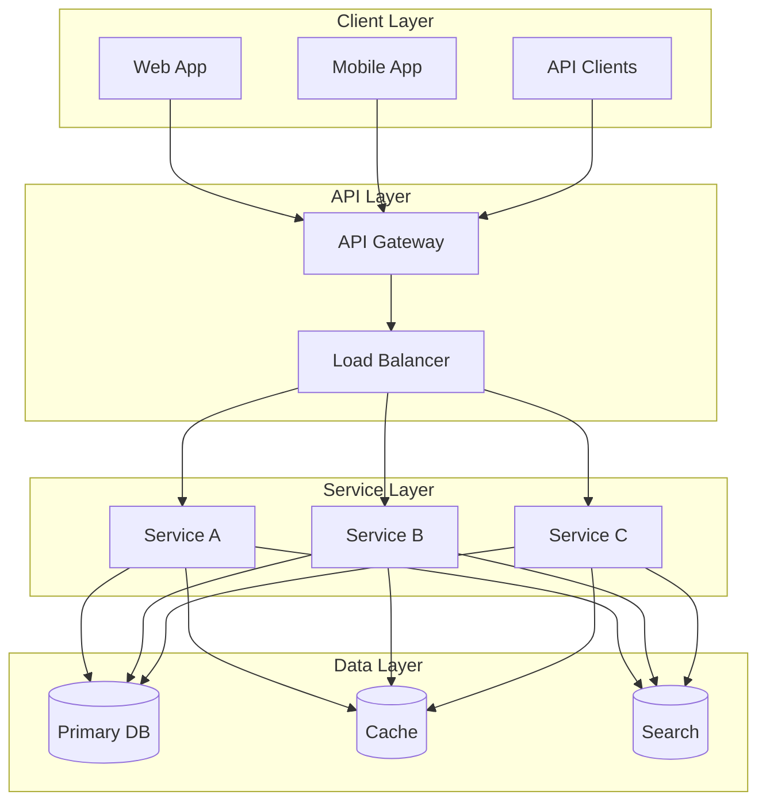
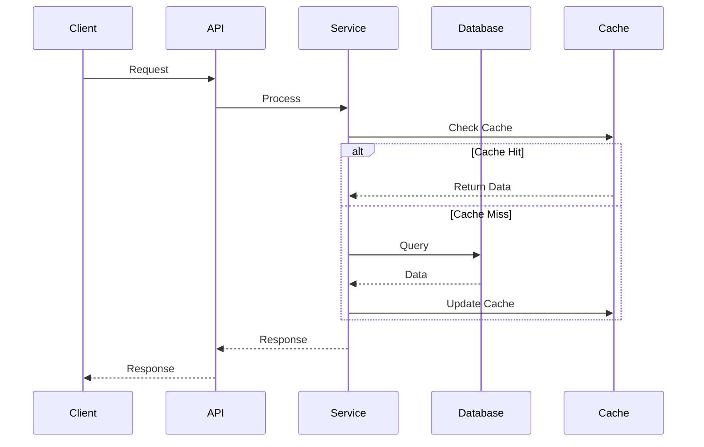
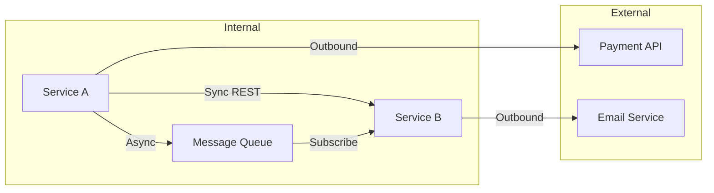
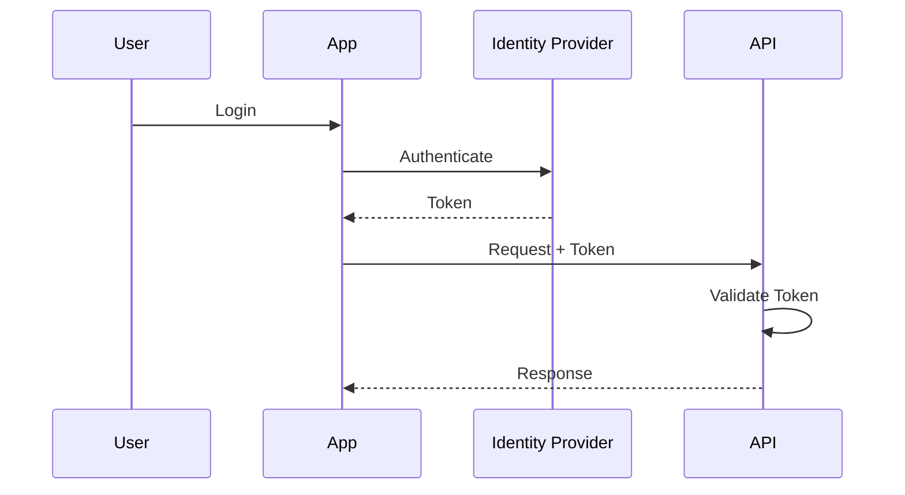
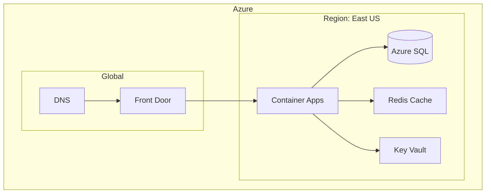
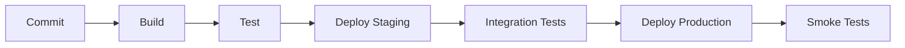

# Architecture Documentation Template

Template for generating comprehensive architecture documentation.

---

# [Project Name] Architecture

## Overview

### Purpose

[Brief description of what the system does and its primary value proposition]

### Key Characteristics

- **Scalability:** [How the system scales]
- **Availability:** [Availability targets]
- **Security:** [Security approach]
- **Performance:** [Performance characteristics]

---

## System Architecture

### High-Level Overview



### Architecture Style

[Describe the architecture style: Monolith, Microservices, Event-driven, etc.]

**Rationale:** [Why this architecture was chosen - reference ADRs]

---

## Components

### Component Overview

| Component | Type | Technology | Purpose |
|-----------|------|------------|---------|
| API Gateway | Infrastructure | Azure API Management | Request routing, auth |
| Core Service | Backend | .NET 8 | Business logic |
| Data Service | Backend | .NET 8 | Data access |
| Web App | Frontend | React | User interface |
| Database | Storage | PostgreSQL | Persistent storage |
| Cache | Storage | Redis | Performance |

### Component Details

#### [Component Name]

**Purpose:** [What this component does]

**Responsibilities:**
- [Responsibility 1]
- [Responsibility 2]
- [Responsibility 3]

**Technology Stack:**
- Runtime: [e.g., .NET 8]
- Framework: [e.g., ASP.NET Core]
- Key Libraries: [e.g., Entity Framework Core, MediatR]

**Interfaces:**
- Exposes: [APIs/events this component provides]
- Consumes: [APIs/events this component uses]

**Data:**
- Owns: [Data entities owned by this component]
- References: [Data entities referenced but not owned]

---

## Data Architecture

### Data Flow



### Data Models

#### Core Entities

| Entity | Description | Storage |
|--------|-------------|---------|
| User | User accounts | PostgreSQL |
| Order | Customer orders | PostgreSQL |
| Product | Product catalog | PostgreSQL |
| Session | User sessions | Redis |

### Data Storage

| Store | Purpose | Technology | Retention |
|-------|---------|------------|-----------|
| Primary | Transactional data | PostgreSQL | Indefinite |
| Cache | Performance | Redis | 24 hours |
| Search | Full-text search | Elasticsearch | Indefinite |
| Archive | Historical data | Blob Storage | 7 years |

---

## Integration Architecture

### External Integrations

| System | Type | Protocol | Purpose |
|--------|------|----------|---------|
| Payment Gateway | Third-party | REST | Payment processing |
| Email Service | Third-party | SMTP/API | Notifications |
| Identity Provider | Third-party | OIDC | Authentication |

### Integration Patterns



---

## Security Architecture

### Authentication & Authorization



### Security Layers

| Layer | Mechanism | Purpose |
|-------|-----------|---------|
| Network | Azure Private Endpoints | Isolation |
| Transport | TLS 1.3 | Encryption in transit |
| Application | OAuth 2.0 + RBAC | Access control |
| Data | AES-256 | Encryption at rest |

### Security Boundaries

[Describe trust boundaries and security zones]

---

## Deployment Architecture

### Infrastructure



### Environments

| Environment | Purpose | Configuration |
|-------------|---------|---------------|
| Development | Feature development | Single instance, reduced resources |
| Staging | Pre-production testing | Production-like, isolated data |
| Production | Live system | Full redundancy, auto-scaling |

### Deployment Process



---

## Observability

### Monitoring

| Aspect | Tool | Metrics |
|--------|------|---------|
| APM | Application Insights | Latency, errors, throughput |
| Infrastructure | Azure Monitor | CPU, memory, network |
| Logs | Log Analytics | Application logs |
| Alerts | Azure Alerts | SLA violations |

### Logging Strategy

```
[Timestamp] [Level] [CorrelationId] [Service] [Message] [Context]
```

### Health Checks

| Check | Frequency | Timeout | Action on Failure |
|-------|-----------|---------|-------------------|
| API Liveness | 10s | 5s | Restart container |
| Database | 30s | 10s | Alert + failover |
| Dependencies | 60s | 30s | Circuit breaker |

---

## Scalability

### Scaling Strategy

| Component | Scaling Type | Trigger | Limits |
|-----------|--------------|---------|--------|
| API | Horizontal | CPU > 70% | 1-10 instances |
| Workers | Horizontal | Queue depth | 1-5 instances |
| Database | Vertical | Manual | Configurable |

### Performance Targets

| Metric | Target | Current |
|--------|--------|---------|
| P50 Latency | < 100ms | 85ms |
| P99 Latency | < 500ms | 420ms |
| Availability | 99.9% | 99.95% |
| Throughput | 1000 RPS | 1200 RPS |

---

## Decisions Log

| ADR | Decision | Status |
|-----|----------|--------|
| ADR-001 | Use PostgreSQL for primary storage | Accepted |
| ADR-002 | Event-driven architecture for async processing | Accepted |
| ADR-003 | Container Apps for hosting | Accepted |

[Link to full ADR documentation]

---

## Appendix

### Glossary

| Term | Definition |
|------|------------|
| [Term] | [Definition] |

### References

- [Link to related documentation]
- [Link to external resources]

---

*Generated by Documentation Synthesis Skill*
