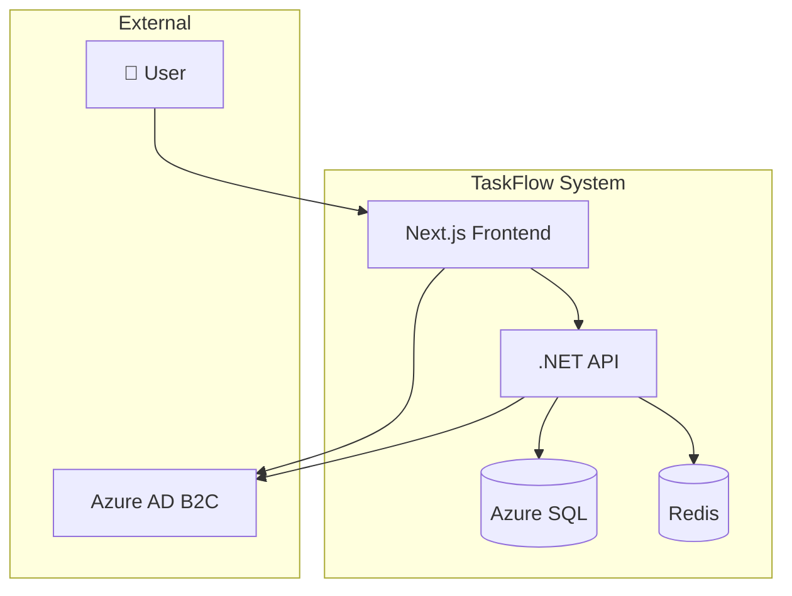
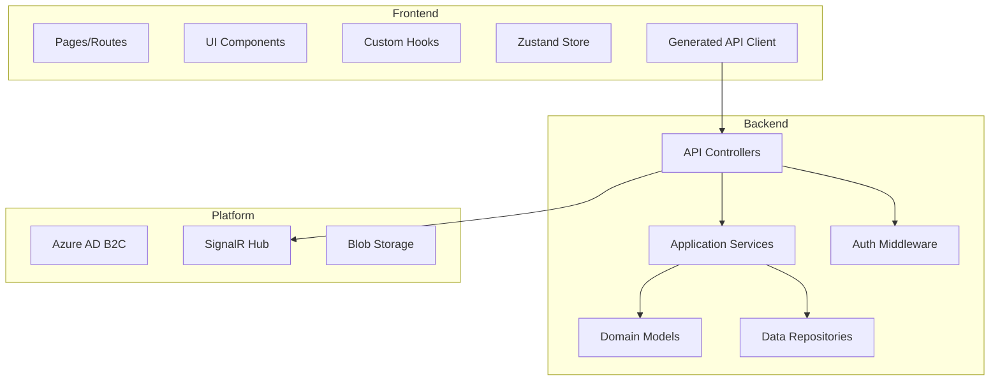
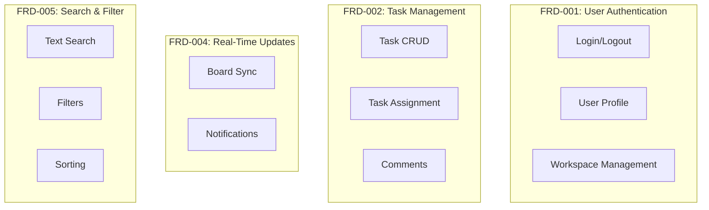
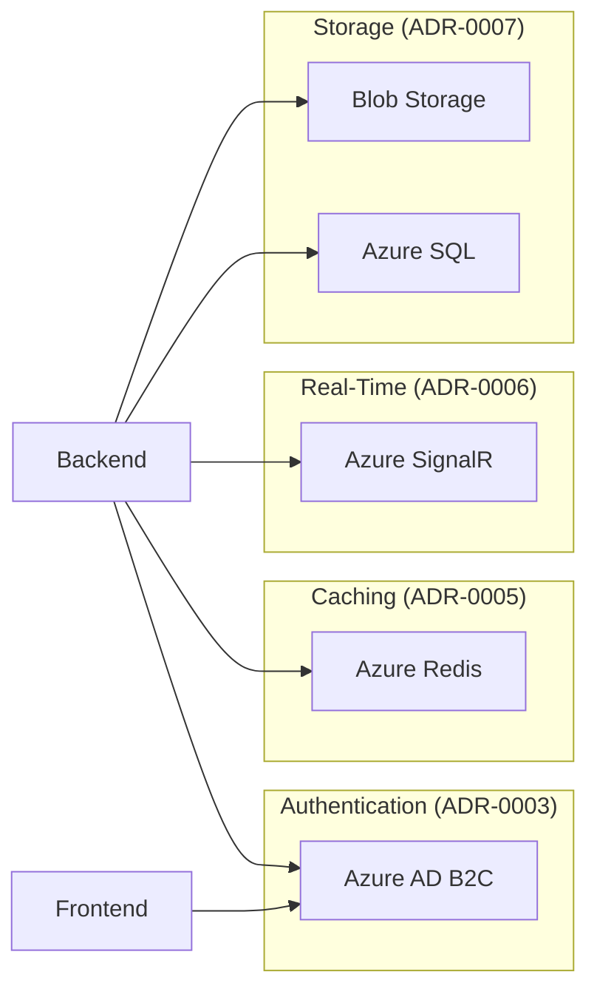

## Plan: TaskFlow MVP Implementation

TaskFlow is a collaborative task management application. This plan covers the MVP implementation including user authentication, task CRUD operations, and a Kanban board interface. The implementation follows a scaffolding-first approach with clear separation between backend API and frontend components.

## Steps

1. **Set up project scaffolding** - Create backend API structure with .NET Aspire, frontend Next.js app, and infrastructure configuration
2. **Implement authentication layer** - Build Azure AD B2C integration for both backend and frontend with JWT token handling
3. **Build task management API** - Create CRUD endpoints for tasks with workspace isolation and real-time update support
4. **Develop Kanban board UI** - Implement drag-and-drop board with real-time updates and responsive design
5. **Add search and filtering** - Enable task search by keyword, assignee, status, and priority
6. **Configure deployment pipeline** - Set up GitHub Actions for CI/CD to Azure Container Apps

## Open Questions

1. Should we implement WebSocket or Server-Sent Events for real-time updates?
2. What is the maximum workspace size (users/tasks) we need to support in MVP?
3. Do we need audit logging for compliance in the first release?

## Architecture Diagrams

### L0: System Context

### L1: Component Breakdown

### L2: Feature Mapping

### L3: Cross-Cutting Decisions

## Task Breakdown

### Scaffolding Tasks

| Order | Task | Dependencies | Acceptance Criteria |
|-------|------|--------------|---------------------|
| 001 | Backend API scaffolding | None | .NET solution compiles, health endpoint responds |
| 002 | Frontend Next.js scaffolding | None | Next.js dev server runs, pages render |
| 003 | Aspire orchestration setup | 001, 002 | Aspire dashboard shows all services |
| 004 | Database schema initialization | 001 | EF migrations run, tables created |
| 005 | CI/CD pipeline setup | None | GitHub Actions workflow defined |

### Feature Tasks - Authentication (FRD-001)

| Order | Task | Dependencies | Acceptance Criteria |
|-------|------|--------------|---------------------|
| 010 | Azure AD B2C configuration | None | Tenant configured, app registrations created |
| 011 | Backend auth middleware | 001, 010 | JWT validation works, 401 on invalid tokens |
| 012 | Frontend MSAL integration | 002, 010 | Login flow works, tokens stored securely |
| 013 | User profile API | 011 | GET/PUT profile endpoints functional |
| 014 | Profile UI component | 012, 013 | Profile page renders, edits save |

### Feature Tasks - Task Management (FRD-002)

| Order | Task | Dependencies | Acceptance Criteria |
|-------|------|--------------|---------------------|
| 020 | Task domain model | 004 | Entity defined, migrations applied |
| 021 | Task CRUD API | 011, 020 | All CRUD endpoints work, workspace scoped |
| 022 | Task list component | 012, 021 | Tasks display in list view |
| 023 | Task detail component | 022 | Task detail modal works |
| 024 | Task assignment API | 021 | Assignment endpoints work |
| 025 | Assignment UI | 023, 024 | User picker works, assignments save |

### Feature Tasks - Kanban Board (FRD-003)

| Order | Task | Dependencies | Acceptance Criteria |
|-------|------|--------------|---------------------|
| 030 | Kanban board API | 021 | Board columns and ordering endpoints |
| 031 | Board component | 022, 030 | Board renders with columns |
| 032 | Drag-and-drop | 031 | Tasks movable between columns |
| 033 | Board persistence | 032 | Column order persists |

### Feature Tasks - Real-Time (FRD-004)

| Order | Task | Dependencies | Acceptance Criteria |
|-------|------|--------------|---------------------|
| 040 | SignalR hub setup | 001 | Hub accessible, auth works |
| 041 | Task change events | 021, 040 | Events broadcast on CRUD |
| 042 | Frontend SignalR client | 031, 040 | Client connects, receives events |
| 043 | Board real-time sync | 041, 042 | Board updates in <2 seconds |

## Assumptions

- Team has Azure subscription with required services
- Azure AD B2C tenant available or can be created
- Frontend developers familiar with React/Next.js
- Backend developers familiar with .NET 8 and EF Core

## Risks

| Risk | Impact | Mitigation |
|------|--------|------------|
| SignalR scaling complexity | High | Start with Azure SignalR Service |
| AD B2C learning curve | Medium | Use built-in flows initially |
| Real-time performance issues | Medium | Implement caching, optimize queries |

## Sources

- [PRD](specs/prd.md) - Product vision and requirements
- [FRD-001](specs/features/user-authentication.md) - Authentication feature
- [FRD-002](specs/features/task-management.md) - Task management feature
- [FRD-003](specs/features/kanban-board.md) - Kanban board feature
- [FRD-004](specs/features/real-time-updates.md) - Real-time updates feature
- [ADR-0003](specs/adr/0003-authentication-strategy.md) - Auth decision

---

*Confidence Level: 85%*
*Last Updated: December 2024*
