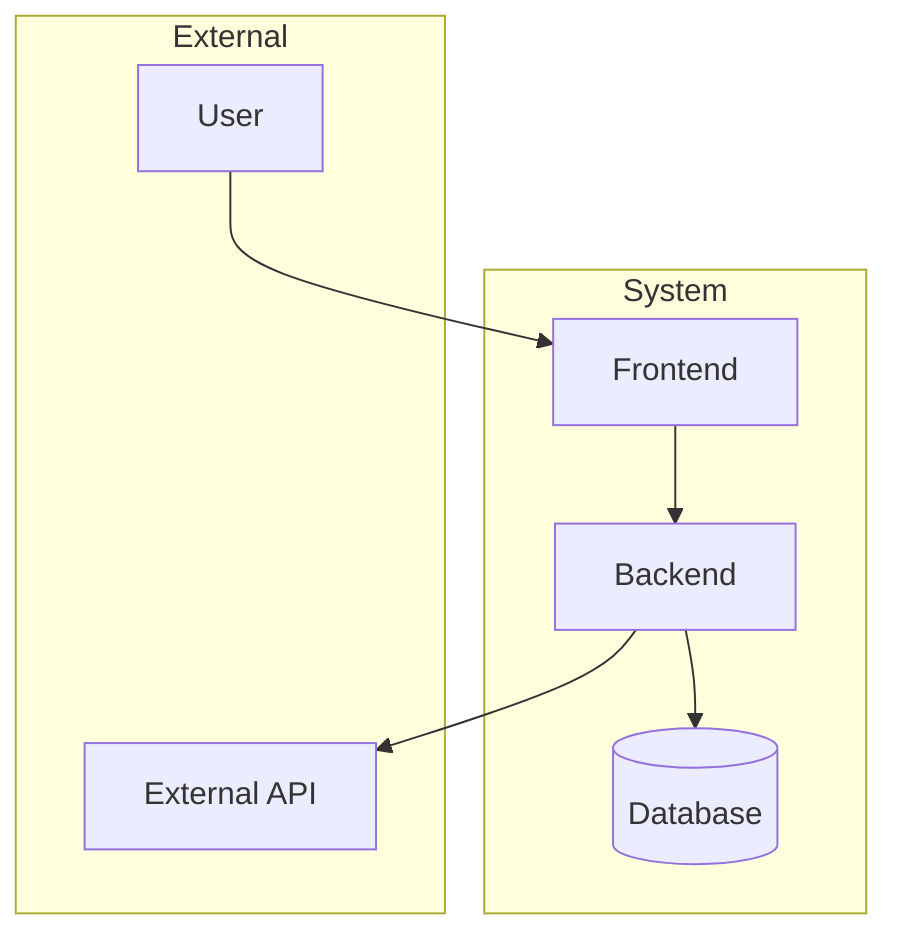
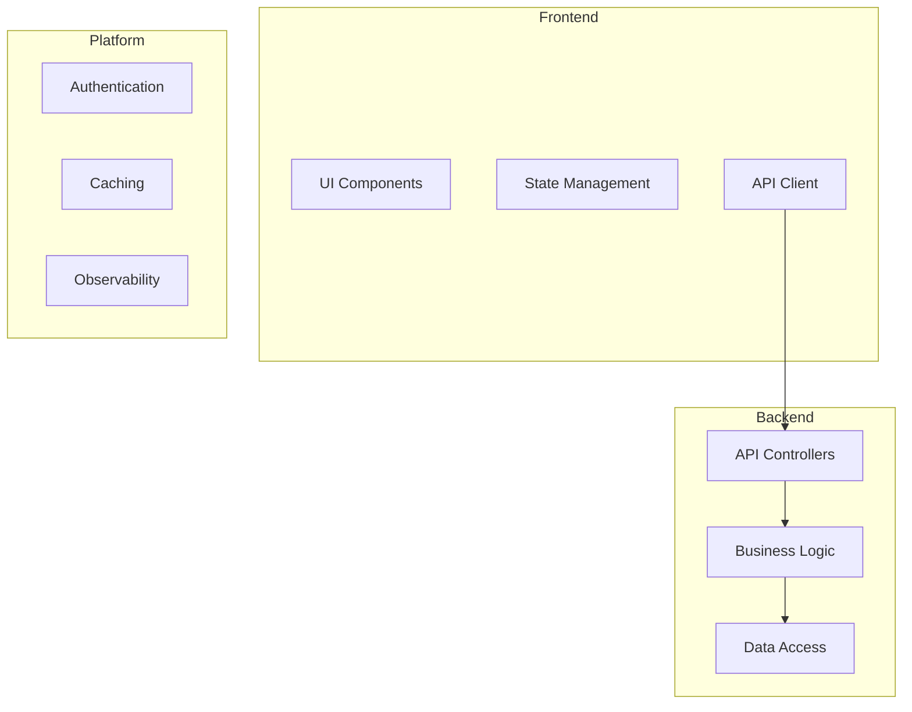
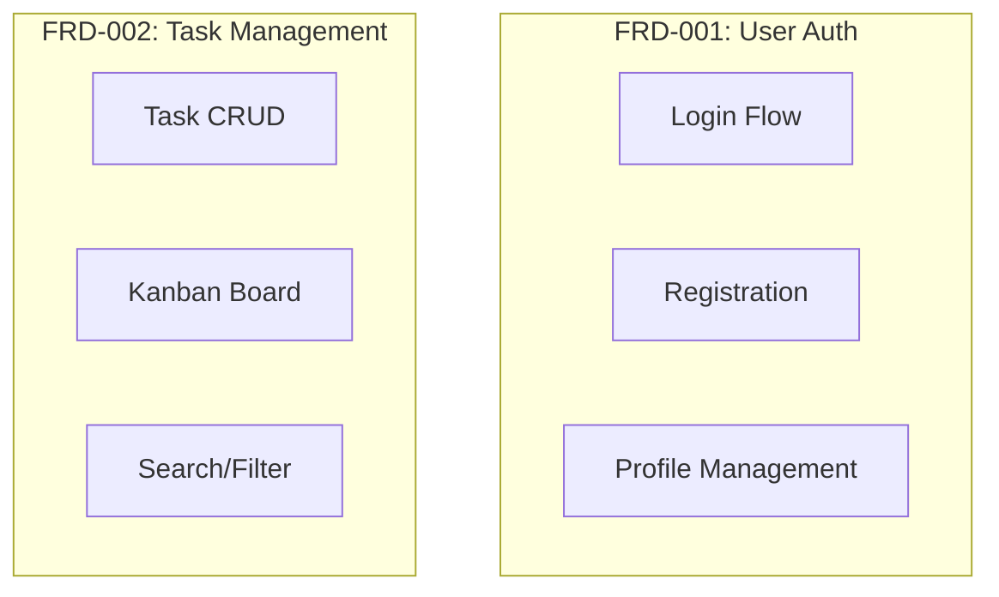
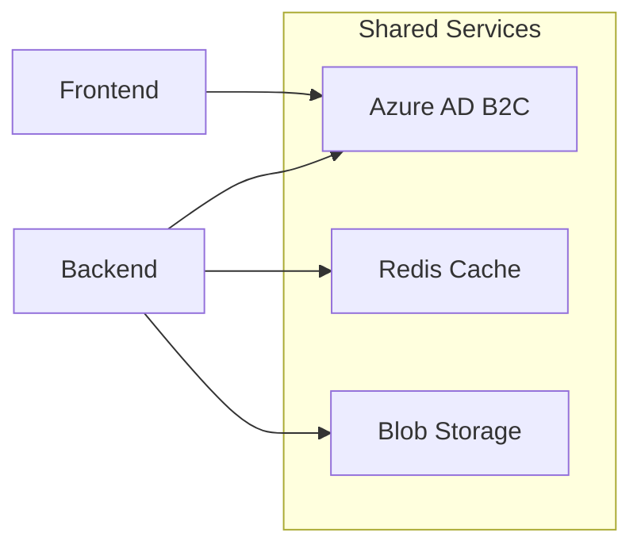

# Implementation Plan Template

Use this template to create implementation plans.

---

## Plan: [Title (2-10 words)]

[TL;DR: 20-100 words summarizing the plan]

## Steps

1. **[Verb-first action]** - [5-20 words, concrete description]
2. **[Verb-first action]** - [5-20 words, concrete description]
3. **[Verb-first action]** - [5-20 words, concrete description]
4. **[Verb-first action]** - [5-20 words, concrete description]

## Open Questions

1. [Question requiring stakeholder input]
2. [Technical decision pending]
3. [Clarification needed]

## Architecture Diagrams

### L0: System Context

### L1: Component Breakdown

### L2: Feature Mapping

### L3: Cross-Cutting Decisions

## Task Breakdown

### Scaffolding Tasks

| Order | Task | Dependencies | Acceptance Criteria |
|-------|------|--------------|---------------------|
| 001 | Backend scaffolding | None | API project compiles |
| 002 | Frontend scaffolding | None | Next.js app runs |
| 003 | Infrastructure scaffolding | None | Aspire configured |

### Feature Tasks

| Order | Task | Dependencies | FRD Reference |
|-------|------|--------------|---------------|
| 010 | User authentication API | 001 | FRD-001 |
| 011 | Login UI component | 002, 010 | FRD-001 |
| 020 | Task CRUD API | 001 | FRD-002 |
| 021 | Task board component | 002, 020 | FRD-002 |

## Assumptions

- [Assumption 1]
- [Assumption 2]

## Risks

| Risk | Impact | Mitigation |
|------|--------|------------|
| [Risk 1] | [High/Medium/Low] | [Mitigation strategy] |

## Sources

- [PRD](specs/prd.md)
- [FRD-001](specs/features/user-auth.md)
- [ADR-001](specs/adr/0001-auth-strategy.md)

---

*Confidence Level: 80%*
*Last Updated: [Date]*
