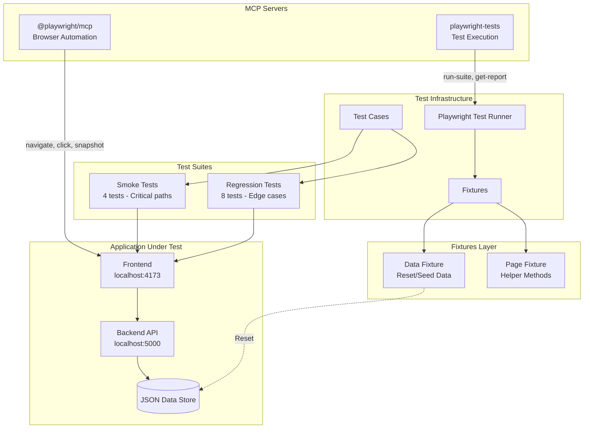

# UI Testing Live Demo Manual

Quick guide for demonstrating the Playwright/MCP test suite.

---

## Architecture Overview



### MCP Servers

| Server | Purpose | Tools |
|--------|---------|-------|
| `playwright` | Browser automation for AI agents | `browser_navigate`, `browser_click`, `browser_snapshot`, `browser_type` |
| `playwright-tests` | Test suite execution | `test:run-suite`, `test:reset-data`, `test:get-report` |

### Test Components

| Component | Purpose |
|-----------|---------|
| `data.fixture.ts` | Resets test data before each test for idempotency |
| `page.fixture.ts` | Provides helper methods like `getTeamCard()`, `getSaveButton()` |
| `data-testid` attributes | Stable selectors on React components |

---

## Demo Scenarios

### Prerequisites
```bash
# Start both containers (frontend:4173, backend:5000)
docker compose up -d --build

# When done
docker compose down
```

---

### Scenario 0: AI Browser Automation (@playwright/mcp)

**What it demonstrates:** AI agent navigates and interacts with the app using `@playwright/mcp`

**Setup:** Enable the `playwright` MCP server in VS Code or your MCP client.

**Example prompts to give the AI:**

```
Navigate to http://localhost:4173 and take a snapshot of the page
```

```
Click on the first team card and tell me what checklist items are incomplete
```

```
Fill in a check box with "Team Alpha" and take a screenshot
```

**Talking points:**
- Uses accessibility tree, not screenshots (faster, more reliable)
- AI can navigate, click, type, and read page content
- Great for exploratory testing or generating test ideas
- Screenshot capability with `browser_take_screenshot` tool

**Available MCP Tools:**
| Tool | Description |
|------|-------------|
| `browser_navigate` | Navigate to a URL |
| `browser_click` | Click an element by text or selector |
| `browser_type` | Type text into an input |
| `browser_snapshot` | Get accessibility tree of current page |
| `browser_take_screenshot` | Capture visible page as base64 image |
| `browser_select_option` | Select dropdown option |
| `browser_hover` | Hover over an element |

---

### Scenario 1: Homepage Load (SMOKE-001)

**What it tests:** Application loads, teams grid renders, no errors

```bash
cd tests/ui
npx playwright test --grep "SMOKE-001" --project=chromium --headed
```

**Talking points:**
- Navigates to `/` and waits for network idle
- Verifies `[data-testid="teams-container"]` is visible
- Counts team cards (should be > 0)
- Confirms no error container present

---

### Scenario 2: Save Changes Flow (SMOKE-004)

**What it tests:** Toggle checkbox → Save → Toast confirmation → Persistence

```bash
npx playwright test --grep "SMOKE-004" --project=chromium --headed
```

**Talking points:**
- Clicks team card to navigate to details
- Toggles a checkbox using `[data-testid="checkbox-codebase-0"]`
- Unsaved changes bar appears
- Clicks Save, verifies success toast
- Reloads page, confirms state persisted

---

### Scenario 3: API Error Handling (REG-002)

**What it tests:** Graceful error display with retry capability

```bash
npx playwright test --grep "REG-002" --project=chromium --headed
```

**Talking points:**
- Uses `page.route()` to intercept API and return 500
- Error container displays with retry button
- Second request succeeds, teams load normally
- Demonstrates route interception for testing edge cases

---

### Scenario 4: Responsive Layout (REG-007)

**What it tests:** Grid adapts from 2-column to 1-column on mobile

```bash
npx playwright test --grep "REG-007" --project=chromium --headed
```

**Talking points:**
- Starts at desktop viewport (1920×1080)
- Verifies 2-column grid layout
- Resizes to mobile (375×667)
- Confirms cards stack vertically

---

## Quick Commands Reference

| Command | Description |
|---------|-------------|
| `npx playwright test --grep @smoke` | Run all smoke tests |
| `npx playwright test --grep @regression` | Run all regression tests |
| `npx playwright test --headed` | Run with visible browser |
| `npx playwright test --debug` | Step-through debugger |
| `npx playwright test --ui` | Interactive UI mode |
| `npx playwright show-report` | View HTML report |

---

## Test Results Summary

```
Smoke Tests:     4 passed ✅
Regression:      8 passed, 1 skipped ✅
Total:           12 passing tests
Execution time:  ~25 seconds (Chromium only)
```

---

## MCP Configuration

Located at `.github/mcp/playwright.json`:

```json
{
  "mcpServers": {
    "playwright": {
      "command": "npx",
      "args": ["@playwright/mcp@latest", "--headless"]
    },
    "playwright-tests": {
      "command": "node", 
      "args": ["tests/ui/mcp-server/dist/index.js"]
    }
  }
}
```

**To use headed mode** (visible browser), remove `--headless` from the playwright args.

**Custom test server tools:**
- `test:reset-data` - Reset test data to seed state
- `test:run-suite` - Run smoke/regression/all tests
- `test:run-single` - Run a specific test file
- `test:get-report` - Get HTML/JSON/summary report
