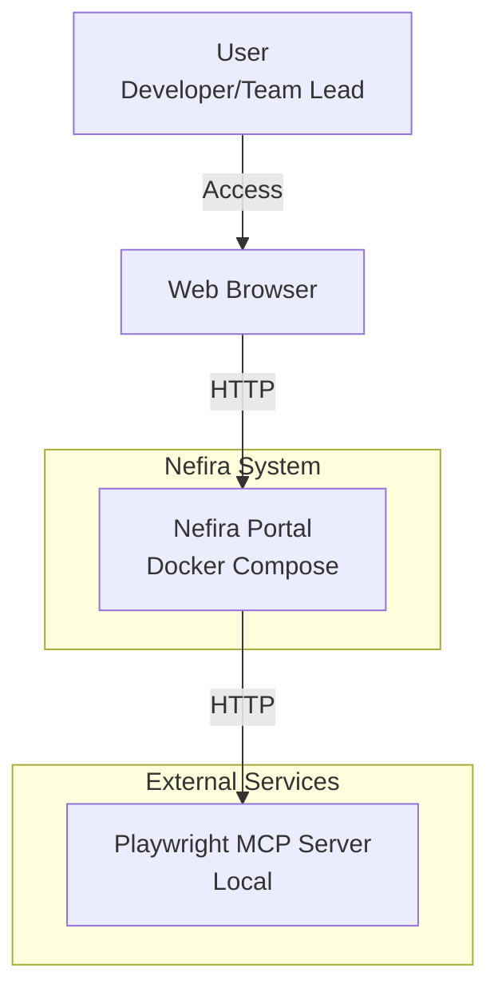
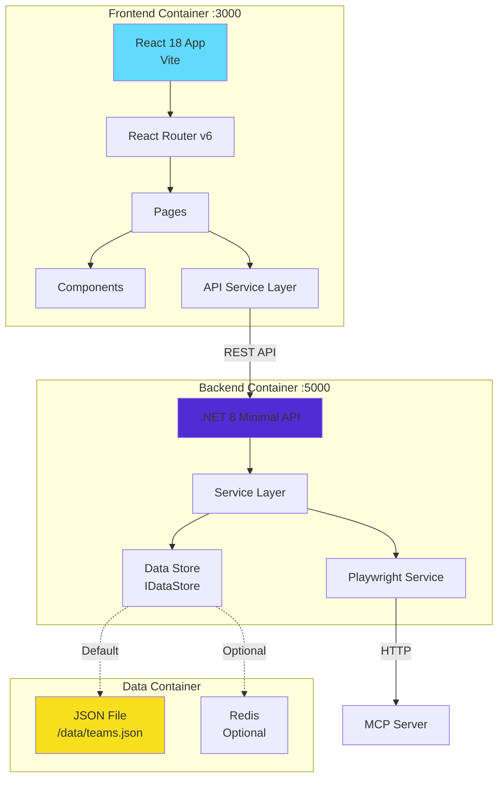
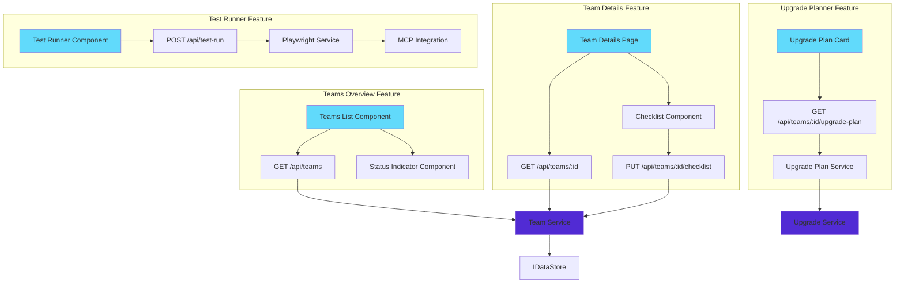
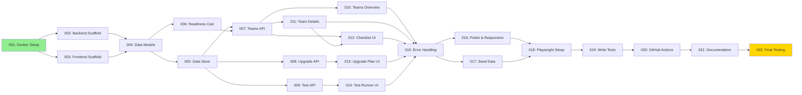

# Implementation Plan: Nefira Developer Readiness Portal

**Date**: 2025-12-30  
**Status**: Ready for Implementation  
**Timeline**: 2-4 weeks (10-20 business days)  
**Confidence**: 85%

## TL;DR

Build a containerized React + .NET web portal that helps development teams track technical readiness through dashboards, checklists, upgrade planning, and automated testing. Implementation follows a scaffolding-first approach: setup infrastructure and project structure, then implement features incrementally, and finally add CI/CD automation. Total estimated effort: 7-10 days for a single developer.

---

## Implementation Steps

### 1. **Setup Project Infrastructure** (Days 1-2)
Create repository structure, Docker configuration, and development environment with health checks and networking.

### 2. **Scaffold Backend API** (Day 2)
Build .NET 8 Minimal API structure with service layer, data models, and JSON data store implementation.

### 3. **Scaffold Frontend Application** (Day 3)
Create React app with Vite, routing structure, API service layer, and base components.

### 4. **Implement Core Features** (Days 4-7)
Build teams dashboard, team details, checklist management, upgrade planner, and test runner features sequentially.

### 5. **Add Seed Data & MCP Integration** (Day 8)
Generate seed data for 2-4 teams and integrate Playwright MCP server for test execution.

### 6. **Setup CI/CD and Testing** (Days 9-10)
Create Playwright tests and GitHub Actions workflow for automated testing.

---

## Architecture Diagrams

### L0: System Context



### L1: Component Architecture



### L2: Feature Breakdown



### L3: Cross-Cutting Concerns

```mermaid
graph TB
    subgraph "Data Persistence Layer"
        IDataStore[IDataStore Interface]
        JsonImpl[JsonDataStore<br/>Default]
        RedisImpl[RedisDataStore<br/>Optional]
        
        IDataStore -.->|Implements| JsonImpl
        IDataStore -.->|Implements| RedisImpl
    end
    
    subgraph "Error Handling"
        GlobalHandler[Global Exception Handler]
        ErrorResponse[Standard Error Response]
        FrontendBoundary[Error Boundary Component]
        
        GlobalHandler --> ErrorResponse
    end
    
    subgraph "Readiness Calculation"
        Calculator[ReadinessCalculator Service]
        Rules[Status Rules<br/>Green: 90%+<br/>Yellow: 50-89%<br/>Red: <50%]
        
        Calculator --> Rules
    end
    
    subgraph "Health Checks"
        BackendHealth[/health endpoint]
        FrontendHealth[nginx health]
        RedisHealth[Redis PING]
    end
    
    subgraph "Configuration"
        AppSettings[appsettings.json]
        EnvVars[Environment Variables]
        DotEnv[.env file]
        
        AppSettings --> EnvVars
        EnvVars --> DotEnv
    end
    
    style IDataStore fill:#90EE90
    style GlobalHandler fill:#FFB6C1
    style Calculator fill:#FFD700
    style BackendHealth fill:#87CEEB
```

---

## Task Breakdown

### Phase 1: Infrastructure Setup (Days 1-2)

**001. Project Structure & Docker Configuration**
- Create repository structure (frontend/, backend/, data/, tests/, docs/)
- Create Dockerfiles for frontend and backend
- Create docker-compose.yml with networking and volumes
- Setup health checks for all containers
- Create .gitignore, .dockerignore files
- Verify: `docker-compose up` starts all services

**002. Backend Project Scaffolding**
- Initialize .NET 8 Web API project
- Add required NuGet packages (Swashbuckle, System.Text.Json)
- Setup Program.cs with CORS, Swagger, dependency injection
- Create folder structure (Models/, Services/, Data/)
- Add health check endpoint
- Verify: Backend responds to /health and /swagger

**003. Frontend Project Scaffolding**
- Initialize React 18 project with Vite
- Setup React Router v6
- Create folder structure (components/, pages/, services/)
- Configure Tailwind CSS (or base CSS)
- Setup API service layer with axios
- Create base layout and navigation
- Verify: Frontend loads at localhost:3000

### Phase 2: Data Layer & Models (Day 2-3)

**004. Define Data Models**
- Create C# record types: Team, TechStack, Checklist, ChecklistItem, UpgradePlan, TestResult
- Create TypeScript interfaces matching C# models
- Add ReadinessStatus enum (Green, Yellow, Red)
- Verify: Models compile without errors

**005. Implement Data Store**
- Create IDataStore interface
- Implement JsonDataStore with SemaphoreSlim locking
- Add seed data generation (2-4 teams with realistic data)
- Add EnsureDataFileExists logic
- Configure dependency injection
- Verify: Seed data loads on startup, JSON file persists updates

**006. Implement Readiness Calculator**
- Create ReadinessCalculator service
- Implement status calculation rules (90%+ = Green, 50-89% = Yellow, <50% = Red)
- Add category-level and team-level aggregation
- Write unit tests (optional at this stage)
- Verify: Status calculations are correct

### Phase 3: API Implementation (Day 3-4)

**007. Teams API Endpoints**
- Implement GET /api/teams (list all teams)
- Implement GET /api/teams/{id} (get team details)
- Implement PUT /api/teams/{id}/checklist (update checklist)
- Add error handling for not found, validation errors
- Test with Swagger UI
- Verify: All endpoints return correct data

**008. Upgrade Plan API**
- Create IUpgradePlanService interface
- Implement UpgradePlanService with version mapping logic
- Add upgrade plans for .NET 6→8, Java 6→11/17, React 16→18
- Implement GET /api/teams/{id}/upgrade-plan endpoint
- Test with Swagger UI
- Verify: Upgrade plans are contextual to tech stack

**009. Test Runner API & MCP Integration**
- Create IPlaywrightService interface
- Implement PlaywrightService with HttpClient to MCP
- Implement POST /api/test-run endpoint
- Add error handling for MCP unavailable
- Configure HttpClient factory
- Verify: Can call MCP endpoint (mock if MCP not ready)

### Phase 4: Frontend Implementation (Days 4-6)

**010. Teams Overview Page**
- Create TeamsOverview page component
- Create TeamCard component with status indicator
- Create ReadinessIndicator component (green/yellow/red)
- Fetch teams from API on mount
- Add loading and error states
- Add navigation to team details
- Verify: Dashboard displays teams with correct statuses

**011. Team Details Page**
- Create TeamDetails page component
- Add route parameter handling for team ID
- Fetch team data from API
- Display team info, tech stack, readiness status
- Add loading and error states
- Verify: Team details page loads with correct data

**012. Checklist Component**
- Create ChecklistSection component
- Create ChecklistItem component with checkbox
- Implement toggle functionality
- Call PUT API on checklist change
- Add optimistic UI updates
- Handle API errors gracefully
- Recalculate and display updated status
- Verify: Checklist updates persist to backend

**013. Upgrade Plan Component**
- Create UpgradePlanCard component
- Fetch upgrade plan from API
- Display current version, target version, steps
- Add GitHub Copilot recommendations section
- Style for visual hierarchy
- Verify: Upgrade plans display correctly for different tech stacks

**014. Test Runner Component**
- Create TestRunnerCard component
- Add "Run Test" button
- Implement API call to POST /api/test-run
- Show loading state during test execution
- Display test results (success/failure, logs, screenshot)
- Handle MCP unavailable gracefully
- Verify: Test execution flow works end-to-end

### Phase 5: Integration & Polish (Days 6-7)

**015. Error Handling & Loading States**
- Add global error boundary to React app
- Implement consistent error message component
- Add loading spinners/skeletons
- Add toast notifications for actions (optional)
- Test error scenarios (API down, network errors)
- Verify: All error paths handled gracefully

**016. Responsive Design & Styling**
- Ensure mobile responsiveness for all components
- Add accessible color contrasts for status indicators
- Polish spacing, typography, layout
- Test on mobile viewport
- Add data-testid attributes for Playwright
- Verify: Works on desktop and mobile

**017. Seed Data Refinement**
- Create comprehensive seed data with 4 teams
- Ensure variety in readiness states (green, yellow, red)
- Add realistic checklist items for all categories
- Add guidance text to checklist items
- Create upgrade plans for each team's stack
- Verify: Demo scenarios are compelling

### Phase 6: Testing & CI/CD (Days 8-10)

**018. Playwright Test Setup**
- Initialize Playwright in tests/ui/
- Create playwright.config.ts
- Configure baseURL, browsers, reporters
- Setup webServer to start docker-compose
- Add test helpers and fixtures
- Verify: Playwright can start app and run basic test

**019. Write Playwright Tests**
- Test: Teams overview loads and displays teams
- Test: Navigate to team details
- Test: Toggle checklist items and verify persistence
- Test: View upgrade plan
- Test: Run test via MCP and view results
- Add screenshots for all tests
- Verify: All tests pass consistently

**020. GitHub Actions Workflow**
- Create .github/workflows/playwright.yml
- Configure workflow to start docker-compose
- Wait for health checks
- Install Playwright and dependencies
- Run tests
- Upload test results and screenshots as artifacts
- Verify: Workflow runs successfully in CI

### Phase 7: Documentation & Delivery (Day 10)

**021. Documentation**
- Update README.md with setup instructions
- Document docker-compose usage
- Add environment variable reference
- Document API endpoints (optional - Swagger provides this)
- Create demo script for APG CoP session
- Verify: New developer can start app following docs

**022. Final Testing & Demo Prep**
- Run full demo flow manually
- Test on clean Docker environment
- Measure startup time (< 60 seconds)
- Measure dashboard load time (< 2 seconds)
- Verify all acceptance criteria from PRD
- Fix any bugs found
- Verify: Demo runs smoothly

---

## Dependencies



---

## Open Questions

1. **MCP Server Availability**: Is the Playwright MCP server already running? If not, who will set it up?
   - **Impact**: Task 009 and 014 depend on this
   - **Mitigation**: Can mock MCP responses initially

2. **Redis vs JSON Default**: Which should be the default in docker-compose.yml?
   - **Recommendation**: JSON by default, Redis commented out as optional
   
3. **TypeScript vs JavaScript**: Should frontend use TypeScript?
   - **Recommendation**: Use TypeScript for type safety (minimal learning curve)

4. **Test Coverage Target**: What percentage of code coverage is required?
   - **Recommendation**: Focus on E2E coverage of critical paths rather than code coverage percentage

5. **Demo Environment**: Where will the demo be presented? (local machine vs hosted)
   - **Impact**: Affects network configuration and MCP setup

---

## Success Criteria

### Technical Acceptance
- ✅ All containers start via `docker-compose up -d` in < 60 seconds
- ✅ Dashboard loads in < 2 seconds
- ✅ All API endpoints return correct data
- ✅ Checklist updates persist across restarts
- ✅ Playwright tests pass in CI/CD
- ✅ Application works on Windows, macOS, Linux

### Functional Acceptance
- ✅ Can view all teams and their readiness status
- ✅ Can navigate to team details
- ✅ Can toggle checklist items and see status update
- ✅ Can view upgrade plans specific to tech stack
- ✅ Can trigger tests and view results
- ✅ All PRD user stories satisfied

### Demo Readiness
- ✅ 4 teams with varied readiness states (green, yellow, red)
- ✅ Compelling checklist items with guidance
- ✅ Realistic upgrade plans
- ✅ Demo flow completes in 5-7 minutes
- ✅ No external dependencies (except local MCP)

---

## Risk Assessment

| Risk | Probability | Impact | Mitigation |
|------|-------------|--------|------------|
| MCP server not available | Medium | High | Mock MCP responses initially |
| Container startup failures | Low | Medium | Comprehensive health checks |
| Cross-platform issues | Low | Medium | Test on all platforms early |
| Timeline slippage | Medium | Low | Features are independent, can descope |
| Flaky Playwright tests | Medium | Medium | Use auto-wait, add retries |

---

## Timeline Estimate

**Optimistic**: 7 days (experienced full-stack dev)  
**Realistic**: 10 days (average dev, includes learning curve)  
**Conservative**: 14 days (includes buffer for unknowns)

### Week 1 (Days 1-5)
- Days 1-2: Infrastructure & scaffolding
- Days 3-4: Data layer & API implementation
- Day 5: Frontend teams overview & details

### Week 2 (Days 6-10)
- Days 6-7: Frontend checklist, upgrade, test runner
- Day 8: Integration, seed data, polish
- Days 9-10: Testing, CI/CD, documentation

---

## References

- [Product Requirements Document](../prd.md)
- [Technical Stack Standards](../../docs/technical-stack.md)
- [ADR-0001: Frontend Framework](../adr/0001-frontend-framework-selection.md)
- [ADR-0002: Backend Framework](../adr/0002-backend-framework-selection.md)
- [ADR-0003: Data Persistence](../adr/0003-data-persistence-strategy.md)
- [ADR-0004: Container Orchestration](../adr/0004-container-orchestration-approach.md)
- [ADR-0005: Testing & CI/CD](../adr/0005-testing-and-ci-cd-strategy.md)

---

**Next Step**: Begin implementation with Task 001 (Project Structure & Docker Configuration)
